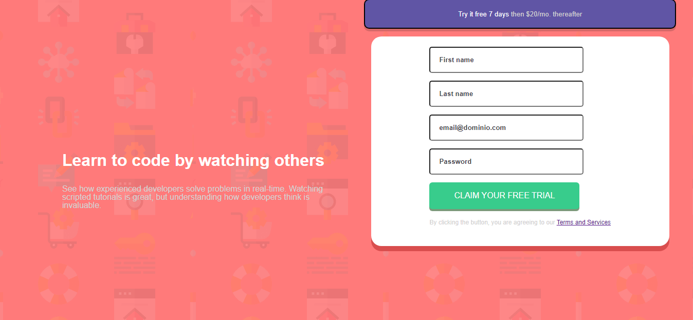

# Intro-component
 
 Esta é uma solução do [Intro component challenge on Frontend Mentor](https://www.frontendmentor.io/challenges/intro-component-with-signup-form-5cf91bd49edda32581d28fd1). Frontend Mentor challenges ajuda você melhorar suas habilidades em fazer códigos com projetos reais.

### Telas

### Links

[Solution URL](https://kaiojesus.github.io/Intro-component/assets/index.html)

### Ferramentas

- HTML 5
- CSS
- JavaScript

### 📝 Aprendizado

Desenvolvi utilizando o modo mobile-first, aprendendo a deixar o design responsivo, porém quando fui desenvolver para pc, não consegui deixar do modo eu gostaria. Tentei alinhar utilizando o display grid, mas não tive muito sucesso.

### Desenvolvimento contínuo

Futuramente voltarei neste projeto para consertar o design para PC, além de inserir a interação com JavaScript que não foi posta.

### Contato ✉

- [LinkedIn](https://www.linkedin.com/in/kaio-jesus/) 
- [kaiojesus41@gmail.com](kaiojesus41@gmail.com)

